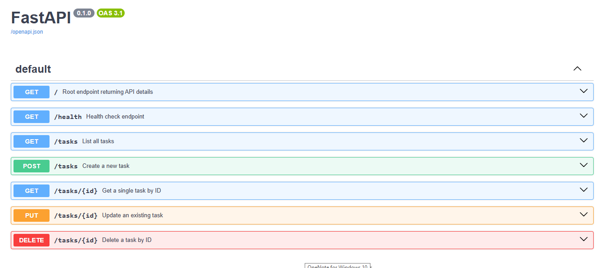

# To-Do Task Management CRUD API (FastAPI)
A lightweight RESTful CRUD API built with Python and FastAPI to manage a to-do list in memory.

### What is this?
 A RESTful API is a web service that uses standard web commands (GET to fetch, POST to create, PUT to update, DELETE to remove) to handle data over HTTP.


## How to Install & Run
Clone or download this repository, open your terminal in the project folder, and run:
```bash
# 1. Create a virtual environment
python -m venv .venv

# 2. Install dependencies
pip install fastapi uvicorn pydantic

# 3. Start the server
uvicorn main:app --reload
```


Once the server is running, open your web browser and go to:
* **API Root:** http://localhost:8000/Interactive
* **Swagger UI:** http://localhost:8000/docs


## API Endpoints
| Method | Endpoint | Description | Expected Status Code |
| :--- | :--- | :--- | :--- |
| `GET` | `/` | API metadata | `200 OK` |
| `GET` | `/health` | Server health check | `200 OK` |
| `GET` | `/tasks` | List all tasks | `200 OK` |
| `GET` | `/tasks/{id}` | Get a single task by ID | `200 OK`, `404 Not Found` |
| `POST` | `/tasks` | Create a new task | `201 Created`, `400 Bad Request` |
| `PUT` | `/tasks/{id}` | Update an existing task | `200 OK`, `400 Bad Request`, `404 Not Found` |
| `DELETE` | `/tasks/{id}` | Delete a task by ID | `204 No Content`, `404 Not Found` |


## Sample curl -i Output

```http
HTTP/1.1 201 Created
date: Sun, 16 Aug 2026 17:23:35 GMT
server: uvicorn
content-length: 61
content-type: application/json

{"title":"Buy milk","description":"","completed":false,"id":4}
```


## Swagger UI Screenshot


